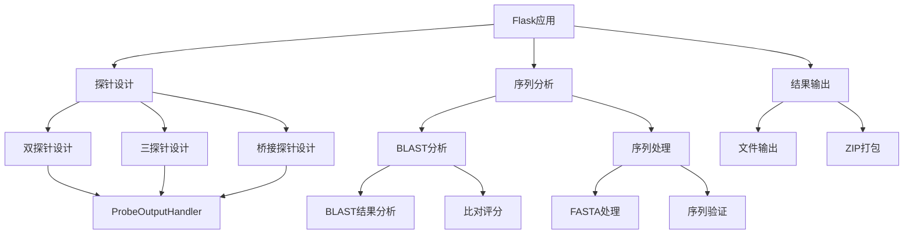

# Probe Generator

该脚本用于生成探针，并根据一些过滤条件进行探针筛选。最终输出满足条件的探针列表。

## 用法

1. 安装依赖

确保已安装以下依赖：
- Python 3.x
- 相关Python库（具体依赖见requirements.txt）
- BLAST软件（如果使用了BLAST功能）

2. 准备输入文件

- `seq.txt`：包含待处理序列的文本文件。

3. 运行脚本

```bash
python probe_generator.py --input seq.txt --probe-size 50 --initiator-type B1 --polyN 2 --min-gc 0.3 --max-gc 0.5 --output probes.txt --blastdb blastdb.fasta
```

参数说明：

--input：输入序列文件的路径。
--probe-size：探针的大小。
--initiator-type：选择的初始化器类型。
--polyN：Poly N过滤的阈值。
--min-gc：GC含量过滤的最小阈值。
--max-gc：GC含量过滤的最大阈值。
--output：输出文件的路径。
--blastdb：可选参数，BLAST数据库的路径。如果提供了该参数，将基于BLAST结果进行探针过滤。

查看结果

脚本会生成一个包含满足条件的探针列表的输出文件（probes.txt）。你可以查看该文件来获取生成的探针信息。

> 目前代码中BLAST的地址如果不在PATH中，需要手动设置HCR_prober_generator.py 中的 cmd = ""

## Flask应用

如果需要运行网页端，需要额外安装一个flask

```bash
pip install flask
```

运行方法

```bash
python app.py
```

## 代码结构与依赖关系

### 主要模块

1. 探针设计模块
- 双探针设计 (Dual Probe)
- 三探针设计 (Triple Probe) 
- 桥接探针设计 (Bridge Probe)

2. Web应用模块
- Flask应用服务
- 探针设计接口
- 结果展示

3. 工具模块
- FASTA文件处理
- BLAST分析
- 序列分析工具

### 函数依赖关系图



### 核心功能模块说明

1. 探针设计模块
- `DualProbeDesigner`: 双探针设计类
- `TripleProbeDesigner`: 三探针设计类
- `BridgeProbeSystem`: 桥接探针系统类

2. 输出处理模块
- `ProbeOutputHandler`: 探针结果输出处理
- 支持CSV、详细文本等多种输出格式
- 包含BLAST分析结果整合

3. 序列分析工具
- `load_fasta()`: FASTA文件加载
- `load_alias()`: 基因别名加载
- `analyze_blast_results()`: BLAST结果分析

4. Web应用路由
- `/split`: 双探针设计接口
- `/triplet`: 三探针设计接口
- `/bridge`: 桥接探针设计接口

### 文件结构

```
.
├── app.py                    # Flask应用主文件
├── scripts/
│   ├── batch_dual_probe.py   # 双探针批处理
│   ├── batch_triplet_probe.py # 三探针批处理
│   ├── bp_suggestion.py      # 桥接探针建议
│   └── utils.py             # 通用工具函数
├── src/
│   ├── dual_probe/          # 双探针设计模块
│   ├── triple_probe/        # 三探针设计模块
│   └── bridge_probe/        # 桥接探针模块
└── resources/               # 资源文件
```