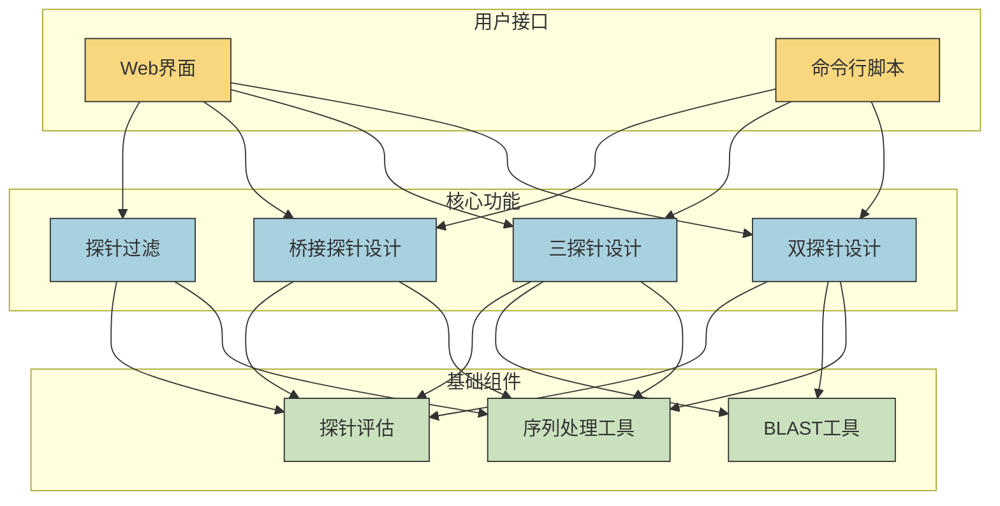
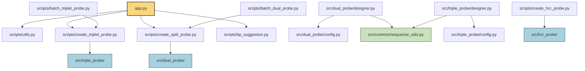
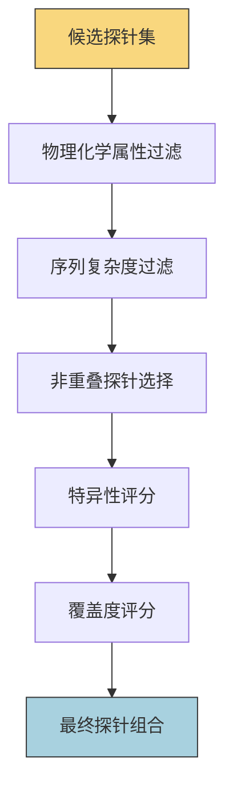

# HCR Designer 项目结构分析

## 项目概述

HCR Designer 是一个用于设计杂交链反应(Hybridization Chain Reaction, HCR)探针的工具。该项目提供了多种探针设计方法，包括双探针(Split/Dual Probe)、三探针(Triplet Probe)和桥接探针(Bridge Probe)等。项目采用Flask框架构建Web应用，同时提供命令行脚本用于批量处理。

### 整体架构



## 目录结构

```
.
├── app.py                  # 主Flask应用入口
├── docs                    # 文档目录
├── resources               # 资源文件目录，包含参考序列和探针表
├── scripts                 # 命令行脚本
├── src                     # 核心源代码
├── static                  # 静态资源文件
├── templates               # HTML模板
└── tests                   # 测试代码
```

## 核心模块分析

### 1. 主应用 (app.py)

- **功能**: Flask Web应用的入口点，提供Web界面用于探针设计
- **依赖**: Flask, scripts/utils, scripts/create_triplet_probe, scripts/create_split_probe, scripts/bp_suggestion
- **主要路由**:
  - `/`: 主页
  - `/split`: 双探针设计
  - `/triplet`: 三探针设计
  - `/bridge`: 桥接探针设计
  - `/filter`: 探针过滤
  - `/probe_recommend`: 探针推荐

### 2. 脚本模块 (scripts/)

#### 2.1 create_triplet_probe.py
- **功能**: 设计三探针(L, M, R)组合
- **依赖**: src/triple_probe
- **主要函数**:
  - `create_config()`: 创建三探针配置
  - `generate_triplet_probe()`: 生成三探针组合
  - `save_triplet_probes()`: 保存三探针结果
  - `main()`: 主函数入口

#### 2.2 create_split_probe.py
- **功能**: 设计双探针(L, R)组合
- **依赖**: src/dual_probe
- **主要函数**:
  - `create_config()`: 创建双探针配置
  - `generate_dual_probe()`: 生成双探针组合
  - `save_dual_probes()`: 保存双探针结果
  - `main()`: 主函数入口

#### 2.3 bp_suggestion.py
- **功能**: 桥接探针设计和分析
- **依赖**: 无外部依赖
- **主要类和函数**:
  - `BridgeProbeSystem`: 桥接探针系统类
    - `find_dissimilar_probes()`: 查找不相似的探针
    - `find_conflicting_probes()`: 查找冲突的探针
    - `analyze_sequences_conflicts()`: 分析序列冲突
  - `design_multiple_probes()`: 设计多个探针
  - `query_conflicting_probes()`: 查询冲突探针
  - `analyze_input_conflicts()`: 分析输入序列冲突

#### 2.4 batch_triplet_probe.py
- **功能**: 批量处理三探针设计
- **依赖**: create_triplet_probe.py

#### 2.5 batch_dual_probe.py
- **功能**: 批量处理双探针设计
- **依赖**: create_split_probe.py

#### 2.6 create_hcr_probe.py
- **功能**: 创建HCR探针
- **依赖**: src/hcr_probe

#### 2.7 create_snail_probe.py
- **功能**: 创建Snail探针
- **依赖**: 未知

#### 2.8 utils.py
- **功能**: 通用工具函数
- **主要函数**:
  - `load_alias()`: 加载基因别名
  - `load_fasta()`: 加载FASTA文件
  - `generate_unique_id()`: 生成唯一ID
  - `save_sequence()`: 保存序列

### 3. 源代码模块 (src/)

#### 3.1 dual_probe/
- **功能**: 双探针设计核心逻辑
- **主要文件**:
  - `config.py`: 配置类
  - `designer.py`: 设计器类
    - `DualProbeDesigner`: 双探针设计器
  - `output.py`: 输出处理

#### 3.2 triple_probe/
- **功能**: 三探针设计核心逻辑
- **主要文件**:
  - `config.py`: 配置类
  - `designer.py`: 设计器类
  - `output.py`: 输出处理

#### 3.3 bridge_probe/
- **功能**: 桥接探针相关功能
- **主要文件**:
  - `probe_filter.py`: 探针过滤
  - `probe_generator.py`: 探针生成
  - `probe_stat.py`: 探针统计

#### 3.4 common/
- **功能**: 通用功能模块
- **主要文件**:
  - `blast_utils.py`: BLAST工具函数
  - `constants.py`: 常量定义
  - `sequence_utils.py`: 序列处理工具
    - `calculate_tm()`: 计算熔解温度
    - `calculate_gc_content()`: 计算GC含量
    - `is_valid_probe()`: 验证探针有效性
    - `check_poly_n()`: 检查多聚核苷酸
  - `probeset_select.py`: 探针集选择

#### 3.5 hcr_probe/
- **功能**: HCR探针设计

## 依赖关系图



## 功能流程

1. **双探针设计流程**:
   - 用户通过Web界面或命令行提供目标序列
   - 设置探针参数(长度、GC含量、Tm值等)
   - 系统生成所有可能的探针
   - 过滤不符合条件的探针(多聚核苷酸、GC含量、Tm值等)
   - 选择互不重叠的探针组合
   - 输出最终探针结果

2. **三探针设计流程**:
   - 类似双探针设计，但生成三个探针(L, M, R)
   - 额外考虑三个探针之间的间距和兼容性

3. **桥接探针设计流程**:
   - 分析已有探针库
   - 查找不相似或冲突的探针
   - 设计新的桥接探针

## 探针过滤算法

探针过滤是HCR Designer中的关键环节，用于从大量候选探针中筛选出最优的探针组合。系统实现了多种过滤算法，主要包括：

### 1. 基本过滤条件

- **物理化学属性过滤**：
  - GC含量过滤：确保探针的GC含量在指定范围内（通常为40%-60%）
  - Tm值过滤：确保探针的熔解温度在指定范围内（通常为47°C-53°C）
  - 多聚核苷酸过滤：排除含有连续重复碱基的探针（如AAAAA、GGGGG等）

- **序列复杂度过滤**：
  - k-mer重复性检查：计算序列中k-mer的出现频率，排除含有高重复k-mer的探针
  - 低复杂度区域检查：排除含有低复杂度区域的探针

### 2. 非重叠探针选择算法

在`src/dual_probe/designer.py`和`src/triple_probe/designer.py`中实现了两种算法用于选择互不重叠的探针组合：

#### 2.1 贪心算法 (Greedy)

```python
def greedy(position_list):
    """使用贪心算法选择最大数量的非重叠探针
    
    Args:
        position_list: 探针位置列表，如 [[1, 12], [5, 17], [20, 32]]
        
    Returns:
        list: 选中的非重叠探针位置
    """
    if not position_list:
        return []

    # 按结束位置排序
    position_list.sort(key=lambda x: x[1])
    selected_probes = [position_list[0]]

    for probe in position_list:
        # 如果当前探针的起始位置大于最后选中探针的结束位置，则选择该探针
        if probe[0] > selected_probes[-1][1]:
            selected_probes.append(probe)
    
    return selected_probes
```

贪心算法的优点是简单高效，但可能无法获得全局最优解。

#### 2.2 动态规划算法 (DP)

```python
def dp(position_list):
    """使用动态规划算法选择最大数量的非重叠探针
    
    Args:
        position_list: 探针位置列表，如 [[1, 12], [5, 17], [20, 32]]
        
    Returns:
        list: 选中的非重叠探针位置
    """
    if not position_list:
        return []

    position_list.sort(key=lambda x: x[1])
    n = len(position_list)
    dp = [0 for _ in range(n)]
    dp[0] = 1

    for i in range(1, n):
        included = 1 + dp[binary_search(position_list, i)] if binary_search(position_list, i) != -1 else 1
        excluded = dp[i - 1]
        dp[i] = max(included, excluded)

    # 回溯构建结果
    i = n - 1
    selected_probes = []
    while i >= 0:
        if i == 0 or dp[i] != dp[i-1]:
            selected_probes.append(position_list[i])
            i = binary_search(position_list, i)
        else:
            i -= 1

    return selected_probes[::-1]
```

动态规划算法能够获得全局最优解，但计算复杂度较高。

### 3. ProbeSet选择算法

在`src/common/probeset_select.py`中实现了探针组合的选择算法，主要考虑以下因素：

1. **覆盖度最大化**：选择能够覆盖目标序列更多区域的探针组合
2. **特异性优先**：优先考虑特异性高的探针组合，即每个探针错配≤2的组合
3. **间距优化**：确保各个探针组合之间的间距≥15bp，避免相互干扰



### 4. 大语言模型辅助过滤

在app.py中的`filter_probe_by_llm`函数实现了使用大语言模型辅助过滤探针的功能：

```python
def filter_probe_by_llm(probe_data):
    """使用大语言模型辅助过滤探针组合"""
    # 构造提示词
    user_prompt = f"""你是一个生物信息学专家，请严格按以下规则，对探针组合进行筛选:
    1. 探针的特异性排序，优先考虑每个探针对中，每个探针错配≤2的组合
    2. 各个探针组合的间距≥15bp
    3. 覆盖度最大化
    """
    
    # API调用处理
    # ...
    
    # 返回筛选结果
    return filtered_probes
```

这种方法结合了传统算法和大语言模型的优势，能够更智能地筛选探针组合。

## 测试模块

- `test_filter_probe.py`: 测试探针过滤功能
- `test_sequence_utils.py`: 测试序列工具函数
- `test_tcr.py`: 测试TCR相关功能